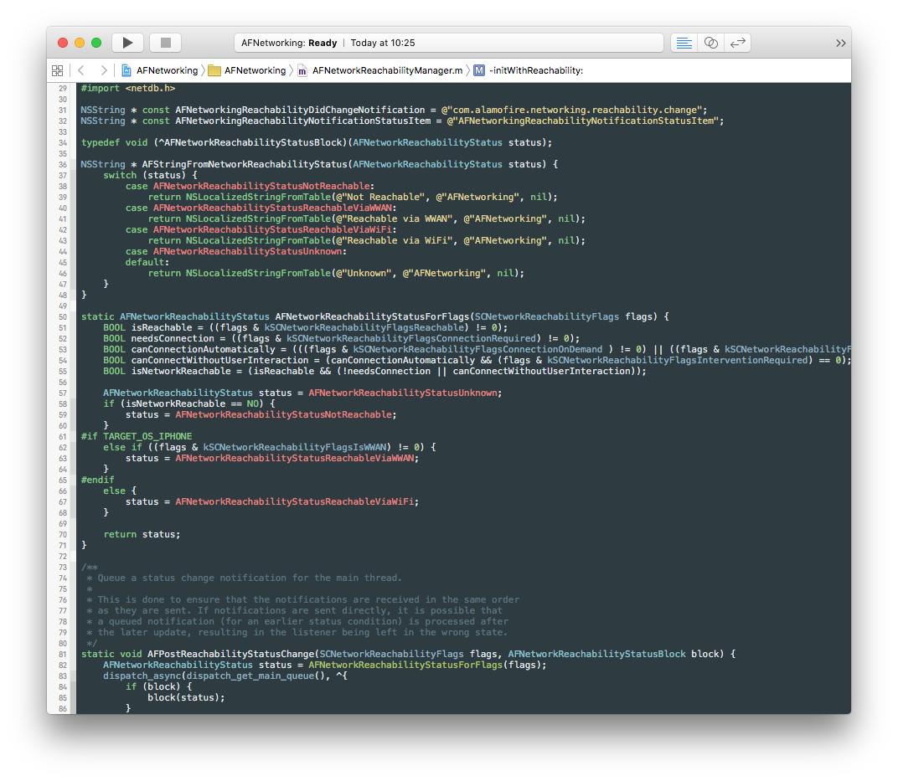
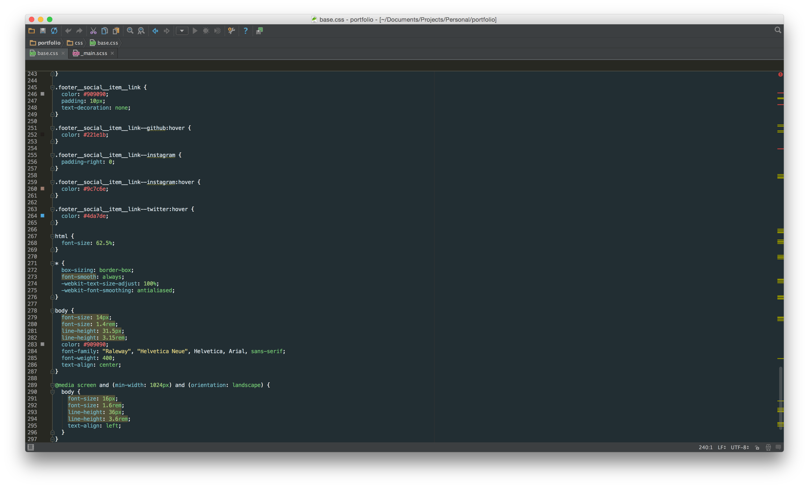

# Toothpaste
A custom theme for Sublime Text, Atom, Xcode and WebStorm with flavorful colors that pop and are muted where necessary

## Sublime Text

### Installation:
#### With Package Control (*Coming Soon*)
1. Run Package Control in Sublime
2. Search for 'toothpaste' and Install
3. Go to Preferences > Color Schemes > Toothpaste

#### Manually
1. Download the theme file
2. ~/Library/Application\ Support/Sublime\ Text\ 2/Packages/ (OS X), ~/AppData/Roaming/"Sublime Text 2"/Packages/ (Windows 7+)
3. mkdir toothpaste
4. rsync -av ~/Downloads/toothpaste.tmTheme ~/Library/Application\ Support/Sublime\ Text\ 2/Packages/toothpaste
5. Start Sublime Text
6. Go to Preferences > Color Schemes > Toothpaste Color Scheme

## Atom

### Installation:
#### With [Atom Package Manager](https://atom.io/themes/toothpaste)
1. Navigate to the install section within Atom's settings
2. Search for 'toothpaste' with the `themes` option selected
3. Click `install`
4. Navigate to themes and select `Toothpaste` from the Syntax themes dropdown

#### With `apm` from the Command Line
1. Run `$ apm install Toothpaste`
4. Navigate to the Themes section within Atom's settings
5. Select `Toothpaste` from the Syntax themes dropdown

#### Manually (OSX)
1. Download or clone this repo
2. Either drag the entire directory or clone this repo directly into the packages directory located at `~/.atom/packages/.
3. Navigate to the 'Themes' section within Atom's settings panel and choose `Toothpaste` from the Syntax themes dropdown.

*Note*: Toothpaste for atom works best with the One Dark or One Light UI themes. Toothpaste is a syntax theme and is therefore inherited by One Dark/Light UI themes.

## Xcode

### Installation:
#### With [Alcatraz](http://alcatraz.io)
1. Install Alcatraz: `curl -fsSL https://raw.githubusercontent.com/supermarin/Alcatraz/deploy/Scripts/install.sh | sh`
2. Launch Alcatraz from Xcode (Window > Package Manager)
3. Select Color Themes tab
4. Search for `toothpaste`
5. Click install
6. Restart Xcode
7. Go to Preferences > Fonts & Colors > Toothpaste

#### Manually
1. Download the dvtcolortheme file
2. `rsync -av ~/Downloads/toothpaste.dvtcolortheme ~/Library/Developer/Xcode/UserData/FontAndColorThemes/`
3. Start Xcode
4. Go to Preferences > Fonts & Colors > Toothpaste

## WebStorm

### Installation:
#### Manually
1. Download the theme `.jar` file
2. Navigate to File > Import Settings and select the JAR file you just downloaded

## Contact
- See something wrong? Have suggestions? Open up an issue or pull request. I'll be tweaking the theme here & there. <3
- For any questions or feedback, don't hesistate to reach out via [twitter](http://twitter.com/imcatnoone) or [email](mailto:hello@heyimcat.com).

## Contributors
Toothpaste definitely could not have grown the way it continues to without the contributors helping. I couldn't do it alone. A big thank you to:

- Timothy ([@codetheory](http://twitter.com/@codetheory)) for recreating Toothpaste for Atom
- Adam Swinden ([@AdamSwinden](https://twitter.com/adamswinden)) for recreating Toothpaste for Xcode
- Michiel Renty ([@mrenty](https://twitter.com/mrenty)) for recreating Toothpaste for WebStorm
- Benedikt Lehnert ([@blehnert](https://twitter.com/blehnert)) for whipping up the Toothpaste landing page

## Creating Issues
Run into a dilemma and want to create an issue for it? Go ahead and do so! But first:
- Make sure the issue wasn't already created. Duplicates are hard.
- If there is a duplicate, chime in on the comments! <3
- Make your issue title straight-forward and leave a lovely comment with more info for us
