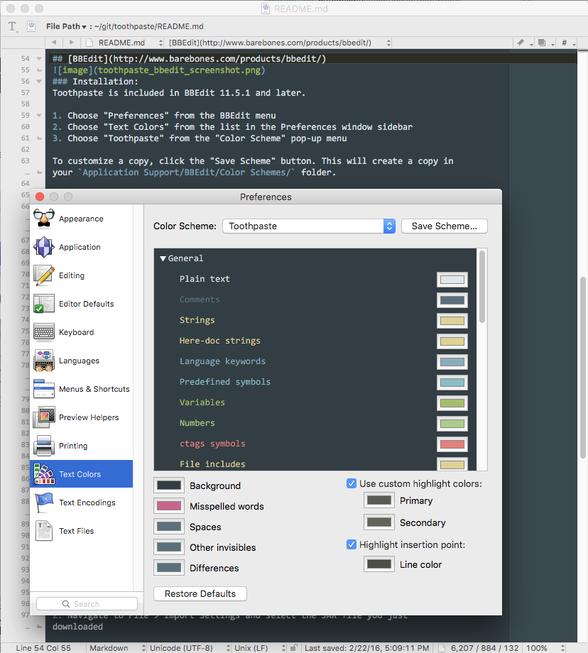

# Toothpaste
A custom theme for Sublime Text, Atom, Xcode, WebStorm, Vim, BBEdit, Visual Studio Code, and Hyper with flavorful colors that pop and are muted where necessary.

## Sublime Text

### Installation:
#### With Package Control (*Coming Soon*)
1. Run Package Control in Sublime
2. Search for `toothpaste` and Install
3. Go to Preferences > Color Schemes > Toothpaste

#### Manually
**Sublime Text 2**

1. Download the theme file
2. For **macOS**: ``~/Library/Application\ Support/Sublime\ Text\ 2/Packages/` and **Windows 7+** `~/AppData/Roaming/"Sublime Text 2"/Packages/`
3. mkdir toothpaste
4. rsync `-av ~/Downloads/toothpaste.tmTheme ~/Library/Application\ Support/Sublime\ Text\ 2/Packages/toothpaste`
5. Start Sublime Text
6. Go to Preferences > Color Schemes > Toothpaste Color Scheme

**Sublime Text 3**

1. Go to the package folder. For **OSX**: `~/Library/Application\ Support/Sublime\ Text\ 3/Installed Packages/` and **Windows 7+** `~/AppData/Roaming/"Sublime Text 3"/Installed Packages/`
2. Clone the repo (rather than saving/downloading the file): `git clone https://github.com/imcatnoone/toothpaste.git`
3. Start Sublime Text
4. Go to Preferences > Color Schemes > Toothpaste Color Scheme

## Atom

### Installation:
#### With [Atom Package Manager](https://atom.io/themes/toothpaste)
1. Navigate to the install section within Atom's settings
2. Search for `toothpaste` with the `themes` option selected
3. Click `install`
4. Navigate to themes and select `Toothpaste` from the Syntax themes dropdown

#### With `apm` from the Command Line
1. Run `$ apm install Toothpaste`
4. Navigate to the Themes section within Atom's settings
5. Select `Toothpaste` from the Syntax themes dropdown

#### Manually (macOS)
1. Download or clone this repo
2. Either drag the entire directory or clone this repo directly into the packages directory located at `~/.atom/packages/`.
3. Navigate to the 'Themes' section within Atom's settings panel and choose `Toothpaste` from the Syntax themes dropdown.

*Note*: Toothpaste for atom works best with the One Dark or One Light UI themes. Toothpaste is a syntax theme and is therefore inherited by One Dark/Light UI themes.

## [BBEdit](http://www.barebones.com/products/bbedit/)

### Installation:
Toothpaste is included in BBEdit 11.6 and later.

1. Choose "Preferences" from the BBEdit menu
2. Choose "Text Colors" from the list in the Preferences window sidebar
3. Choose "Toothpaste" from the "Color Scheme" pop-up menu

To customize a copy, click the "Save Scheme" button. This will create a copy in your `Application Support/BBEdit/Color Schemes/` folder.

#### With [Alcatraz](http://alcatraz.io)
1. Install Alcatraz: `curl -fsSL https://raw.githubusercontent.com/supermarin/Alcatraz/deploy/Scripts/install.sh | sh`
2. Launch Alcatraz from Xcode (Window > Package Manager)
3. Select Color Themes tab
4. Search for `toothpaste`
5. Click install
6. Restart Xcode
7. Go to Preferences > Fonts & Colors > Toothpaste

## Xcode

### Installation:
#### With [Alcatraz](http://alcatraz.io)
1. Install Alcatraz: `curl -fsSL https://raw.githubusercontent.com/supermarin/Alcatraz/deploy/Scripts/install.sh | sh`
2. Launch Alcatraz from Xcode (Window > Package Manager)
3. Select Color Themes tab
4. Search for `toothpaste`
5. Click install
6. Restart Xcode
7. Go to Preferences > Fonts & Colors > Toothpaste

#### Manually
1. Download the dvtcolortheme file
2. `rsync -av ~/Downloads/toothpaste.dvtcolortheme ~/Library/Developer/Xcode/UserData/FontAndColorThemes/`
3. Start Xcode
4. Go to Preferences > Fonts & Colors > Toothpaste

## WebStorm

### Installation:
#### Manually
1. Download the theme `.jar` file
2. Navigate to File > Import Settings and select the JAR file you just downloaded

## Vim

### Installation:
1. Copy `toothpaste.vim` into your `~/.vim/colors`
2. In vim, select the color scheme: `:colorscheme toothpaste`

## Visual Studio Code

### Installation:

#### Via the Command Palette
1. Hit or `CTRL-P`/`CMD+P` to bring up the Command Palette
2. Type in `ext install theme-toothpaste`
3. Restart Visual Studio Code
4. Go to `File` > `Preferences` > `Color Theme` and select `Toothpaste` from the list.

#### Manually
1. Navigate to [your .vscode/extensions folder](https://code.visualstudio.com/docs/extensions/install-extension#_your-extensions-folder)
2. Download the `theme-toothpaste` folder into the extensions folder
3. Restart Visual Studio Code
4. Go to File > Preferences > Color Theme and select `Toothpaste` from the list

## TextMate

### Installation:

1. Launch TextMate.app
2. Open Preferences
3. Select Bundles
4. Click on the Themes tab
5. Find 'toothpaste.tmTheme' on your file system and click open

## macOS Terminal

### Installation:

1. Launch Terminal.app
1. Open Preferences ('Command' + ',' or Terminal > Preferences...)
1. Select 'Profiles'
1. Click on the "gear" icon and select 'Import...'
1. Find ``toothpaste.terminal`` on your file system and click 'Open'

If you want to set toothpaste as your default theme, select toothpaste from the list of Profiles and click on the 'Default' button close to the "gear" icon.

## iTerm2 Terminal

### Installation:

1. Launch iTerm2..app
2. Open Preferences
3. Select 'Profiles'
4. Click on the Colors Tab and then tap on the color presets label
5. Select Import
6. Find 'toothpaste.itermcolors' on your file system and click 'Open'

## Hyper

### Installation:

1. Open `~/.hyper.js` and find the `plugins` array near the bottom
2. Add `'hyperpaste'` and save

## Contact
- See something wrong? Have suggestions? Open up an issue or pull request. I'll be tweaking the theme here & there. <3
- For any questions or feedback, don't hesistate to reach out via [twitter](http://twitter.com/imcatnoone) or [email](mailto:hello@heyimcat.com).

## Contributors
Toothpaste definitely could not have grown the way it continues to without the contributors helping. I couldn't do it alone. A big thank you to:

- Timothy ([@codetheory](http://twitter.com/codetheory)) for recreating Toothpaste for Atom
- Adam Swinden ([@AdamSwinden](https://twitter.com/adamswinden)) for recreating Toothpaste for Xcode
- Michiel Renty ([@mrenty](https://twitter.com/mrenty)) for recreating Toothpaste for WebStorm
- Benedikt Lehnert ([@blehnert](https://twitter.com/blehnert)) for whipping up the Toothpaste landing page
- Josh Fontecha ([@jfontecha](https://twitter.com/jfontecha)) for the manual instructions for ST2 on Windows
- Lachlan Campbell ([@lachlanjc](https://twitter.com/lachlanjc)) for installation instructions with `apm` from Command Line
- Agisilaos Tsaraboulidis ([@AgisilaosTs](https://twitter.com/AgisilaosTs)) for porting Toothpaste over to iTerm2 & TextMate 2
- Dotan Nahum ([@jondot](https://twitter.com/jondot)) for recreating Toothpaste for Vim
- Aalaap Ghag ([@aalaap](http://twitter.com/aalaap)) for porting Toothpaste over to Visual Studio Code
- Ornithologist Coder  ([@OrnithoCoder](https://twitter.com/OrnithoCoder)) for porting Toothpaste over to macOS Terminal

## Contributing
Want to recreate Toothpaste for an IDE that isn't listed? Exciting and the community loves you for it! Before you do, read these little tidbits about how to do so:
- Make sure the issue IDE theme doesn't already exist
- Fork the repo and make the changes to port it over to the IDE.
- Update the README with the current formatting for each IDE submission.
- Submit a pull request when you're ready and be sure to include: the code, a screenshot, name and twitter handle so you can be added to the contributor section of the README and website.

## Creating Issues
Run into a dilemma and want to create an issue for it? Go ahead and do so! But first:
- Make sure the issue wasn't already created. Duplicates are hard.
- If there is a duplicate, chime in on the comments! <3
- Make your issue title straight-forward and leave a lovely comment with more info for us.
