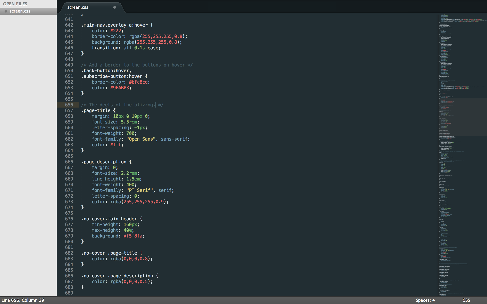
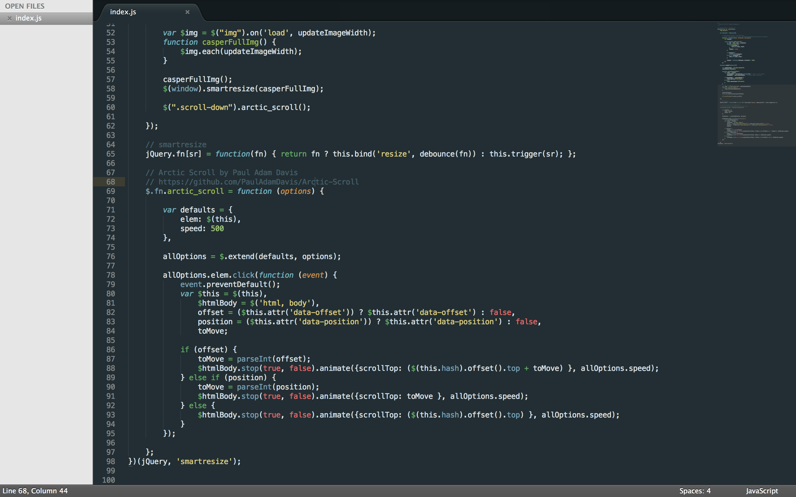

#Toothpaste
A custom theme for SublimeText2 with colors that pop and are muted where necessary

##Installation:
###With Package Control
1. Run Package Control in Sublime
2. Search for 'toothpaste' and Install
3. Go to Preferences > Color Schemes > Toothpaste

###Manually
1. Download the theme file
2. ~/Library/Application\ Support/Sublime\ Text\ 2/Packages/
3. mkdir toothpaste
4. rsync -av ~/Downloads/toothpaste.tmTheme ~/Library/Application\ Support/Sublime\ Text\ 2/Packages/toothpaste
5. Start Sublime Text
6. Go to Preferences > Color Schemes > Toothpaste Color Scheme

##Contact
- See something wrong? Have suggestions? Open up an issue or pull request. I'll be tweaking the theme here & there. <3
- For any questions or feedback, don't hesistate to reach out via [twitter](http://twitter.com/imcatnoone) or [email](mailto:hello@heyimcat.com).
